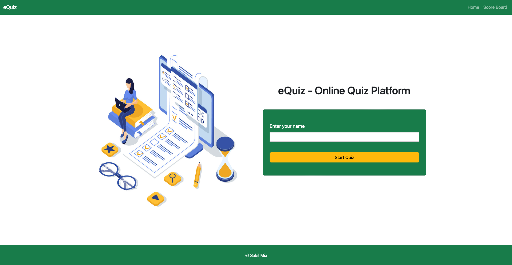
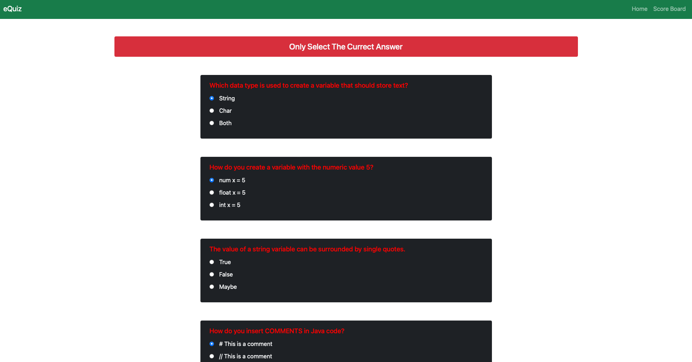
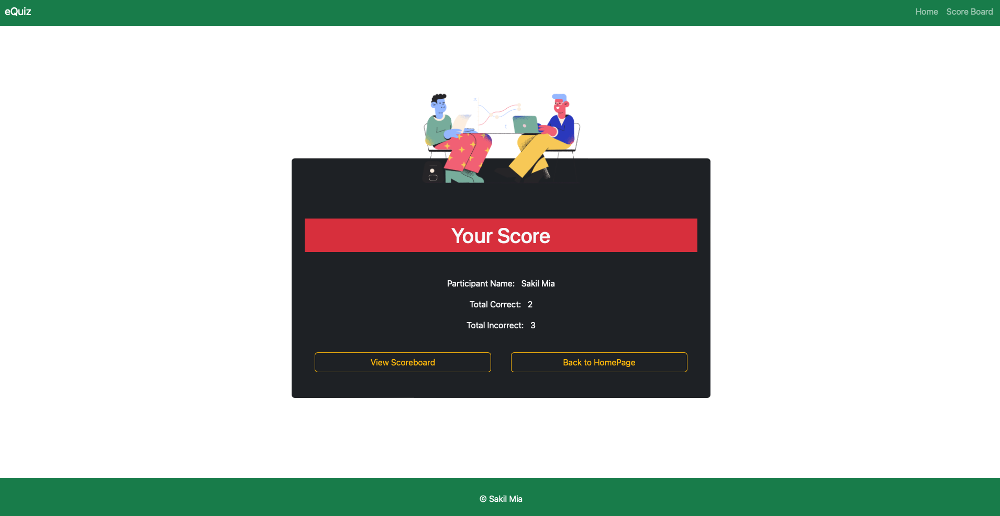
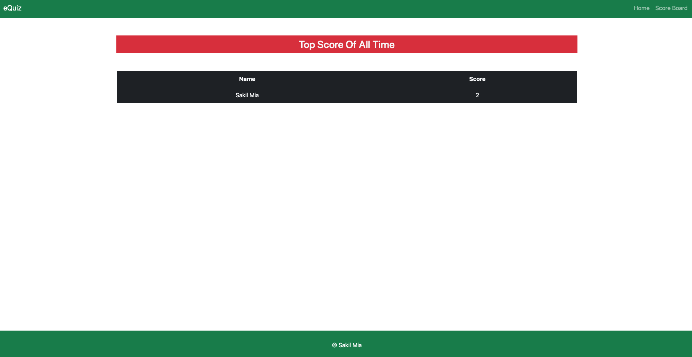

## eQuiz - Online Quiz Platform 

The MCQ (Multiple Choice Question) based quiz application utilizes Spring Boot, Spring Data JPA, MySQL, Thymeleaf, and Bootstrap 5. It provides a user-friendly interface for conducting quizzes with multiple-choice questions. The application leverages Spring Boot for rapid development and simplifies configuration. Spring Data JPA facilitates seamless interaction with the MySQL database, enabling storage and retrieval of quiz data. Thymeleaf and Bootstrap 5 are used for front-end development, allowing for dynamic and responsive UI design. Overall, the application offers a comprehensive solution for MCQ-based quizzes.
## Tech Stack

- **Spring Boot**
- **Spring Data JPA**
- **MySQL**
- **Thymeleaf**
- **Bootstrap 5**

## Authors

- [@sakilmia](https://www.linkedin.com/in/sakilmia/)

## Hope Page

## Quiz Page - 1

## Quiz Page - 2

## Result Page

## Scoreboard

